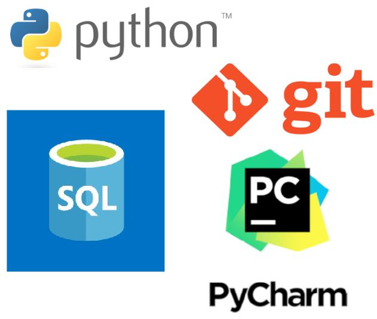
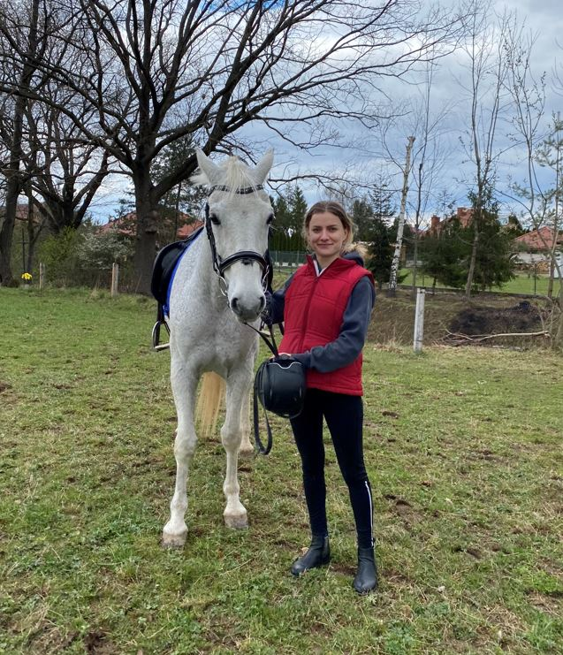

# Alicja Kochanowicz
## O mnie
Cześć, nazywam się Alicja Kochanowicz, jestem początkującą programistką. Chciałabym podzielić się z
Tobą projektami oraz doświadczeniem jakie nabyłam przy ich realizacji.

## Programowanie
Po ukończeniu studiów na kierunku elektrotechnika szukałam dziedziny, w której mogłabym się rozwijać i tak wpadłam na pomysł zgłębienia wiedzy programistycznej. Pierwsze kroki w programowaniu postawiłam w ubiegłym roku przy realizacji kursu „Python 3 od Podstaw do Eksperta” na platformie Udemy. Chciałam w ten sposób sprawdzić czy programowanie to coś dla mnie i skoro to czytasz to za pewne domyślasz się, że postawiłam na tą ścieżkę rozwoju. Kolejnym krokiem w rozwijaniu umiejętności programowania było zapisanie się na kurs do Software Development Academy gdzie pod okiem doświadczonych programistów w bardzo szerokim zakresie zgłębiam tajniki programowania w języku Python. 

Zawsze lubiłam szukać rozwiązań aby ułatwiać sobie powtarzalne czynności, odkąd zauważyłam możliwość wykorzystania programowania do takich właśnie celów programowanie stało się dla mnie jeszcze bardziej przyjemne. 

## Kurs Software Development Academy
Mam przyjemność uczestniczyć w kursie "Python od Podstaw" organizowanym przez Software Development Academy. Kurs składa się z ponad 300 godzin zajęć, dodatkowo wiele godzin tygodniowo poświęcam na pracę samodzielną dzięki czemu zdobyłam wiedzę z następujących tematów: 
* Język Python : Python-podstawy, Python-technologia, Pyton - średniozaawansowany, Algorytmy i struktury danych,
* Testowanie i dobre praktyki: Testowanie oprogramowania i TDD, Wzorce projektowe i dobre praktyki,
* Bazy danych: Bazy danych SQL, Bazy danych – programowanie.

Kurs przewiduje również zagadnienia takie jak Frontend (HTML, CSS, JavaScript) oraz Technologie backendowe, które będę zgłębiać w najbliższych tygodniach.

## Git oraz HTTP
W czasie kursu nauczyłam się nie tylko programować, ale rozwijałem swoje umiejętności w wielu kierunkach między innymi:
* Nauczyłam się pracy z Narzędziem GIT (oraz Gitlab),
* Nauczyłam się podstaw REST API oraz narzędzi sieciowych, dzięki czemu w przyszłej pracy, będę mogła stanowić wsparcie w czasie procesu debugowania back-end'u.

## Testowanie Oprogramowania
Wiem, że współczesne projekty powinny się charakteryzować nie tylko dobrze zaprojektowaną, skalowalną oraz łatwo utrzymywalną architekturą, ale także powinny być odpowiednio przetestowane na poziomie testów jednostkowych oraz integracyjnych. Nauczyłam się testować własny kod, dzięki czemu zaoszczędziło mi to sporo czasu w czasie rozwijania moich projektów.

## Moje projekty
[Komis samochodowy](carDealer.py) | 
[Konto bankowe](bankAccount.py) | 
[Subskrypcje](subscriptions.py) | 
[Sortowanie bąbelkowe](bubbleSort.py)

## Technologie

  
## Zainteresowania
Mam mnóstwo pomysłów na spędzanie wolnego czasu. Oto kilka przykładowych zajęć, przy których się relaksuję i odpoczywam.
 

 
## Kontakt
  
Skontaktuj się ze mną mailowo: alicjakochanowicz7@gmail.com
Linkedin: [Alicja Kochanowicz](http://www.linkedin.com/in/alicja-kochanowicz-057981202)
 
