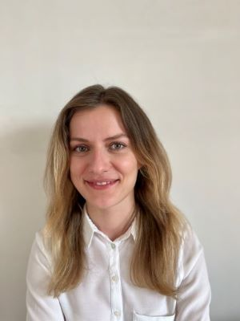
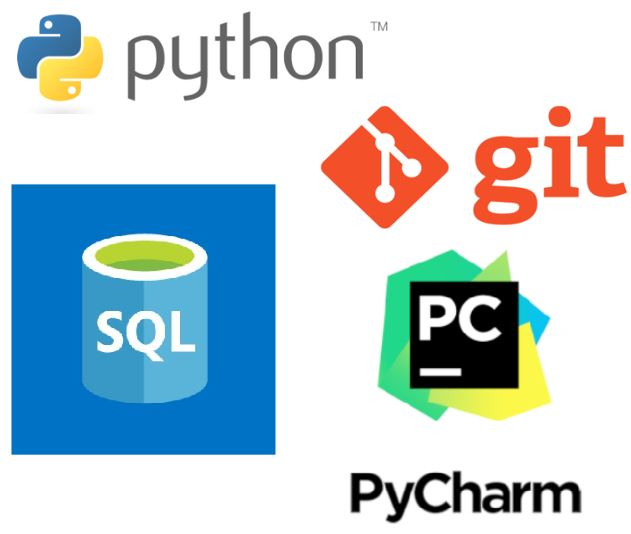
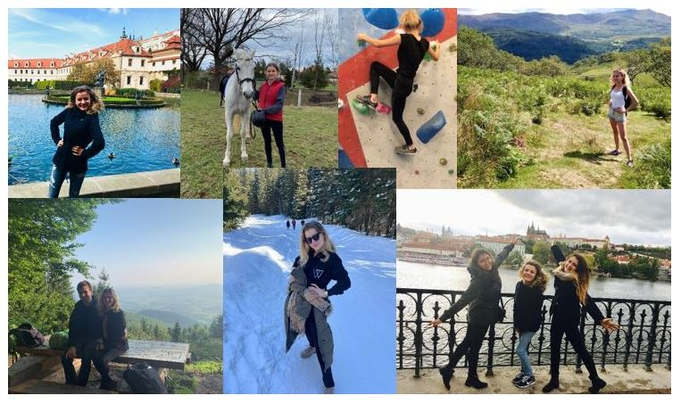

# Alicja Kochanowicz
## About me
Hello, my name is Alicja Kochanowicz, I'm a beginner programmer. I would like share to You my projects and the experience I have gained in their implementation.

## Programming
After completing my master's degree in electrical engineering, I was looking for a field in which I could develop and so I came up with the idea of ​​deepening my programming knowledge.
I took my first steps in programming last year with the "Python 3 From Basics to Expert" course on the Udemy platform.
In this way, I wanted to check if programming is something for me and since you are reading this, you can probably guess that I chose this path of development. The next step in developing my programming skills was enrolling in the Software Development Academy course, where under the watchful eye of experienced programmers I explore the secrets of Python programming in a very wide range. 

I have always liked to look for solutions to facilitate repetitive activities, since I noticed the possibility of using programming for such purposes, programming has become even more enjoyable for me.

## Kurs Software Development Academy
I am pleased to participate in the "Python from Basics" course organized by the Software Development Academy. The course consists of over 300 hours of classes, and I devote many hours a week to independent work, thanks to which I gained knowledge on the following topics:
* Python: Python Basics, Python Technology, Python Intermediate, Algorithms and Data Structures,
* Testing and good practices: Software testing and TDD, Design patterns and good practices,
* Databases: SQL databases, Databases - programming.
* Frontend (HTML, CSS, JavaScript)

The course also covers topic such as Backend Technologies (Django), which I will explore in the coming weeks.

## Git and HTTP
During the course, I learned not only to program, but also developed my skills in many directions, including:
* I learned to work with the GIT tool (and Gitlab),
* I learned the basics of REST API and network tools, so that in my future work, I will be able to provide support during the back-end debugging process.

## Software Testing
I know that modern projects should not only be characterized by a well-designed, scalable and easily maintainable architecture, but also should be properly tested at the level of unit and integration tests. I learned to test my own code, which saved me a lot of time while developing my projects.

## My projects
[Used car dealer](carDealer.py) | 
[Bank account](bankAccount.py) | 
[Subscriptions](subscriptions.py) | 
[Bubble sort](bubbleSort.py) | 
[SQL school diary](SQL_dziennik_szkolny) | 

## Technologies

  
## Interested
I have a lot of ideas for spending my free time. These include travels, mountain tours and various types of physical activity.
 

 
## Contact
  
Contact by e-mail: alicjakochanowicz7@gmail.com
Linkedin: [Alicja Kochanowicz](http://www.linkedin.com/in/alicja-kochanowicz-057981202)
 
