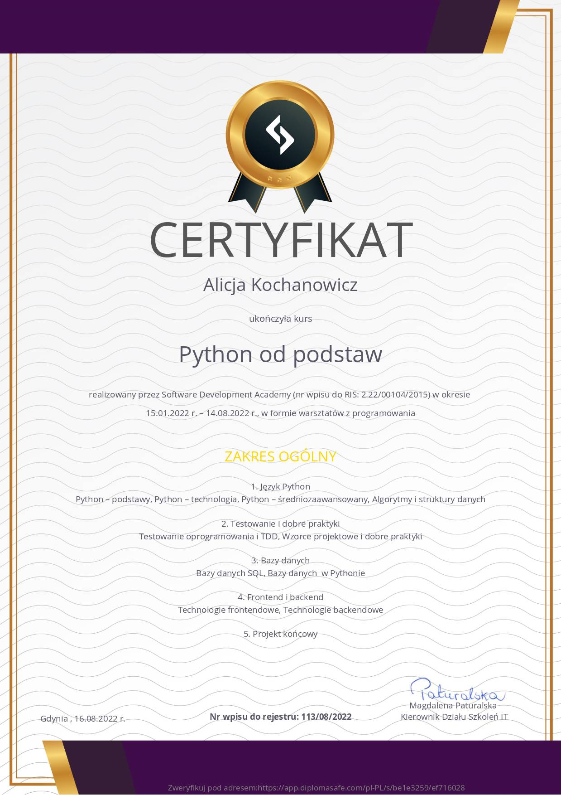
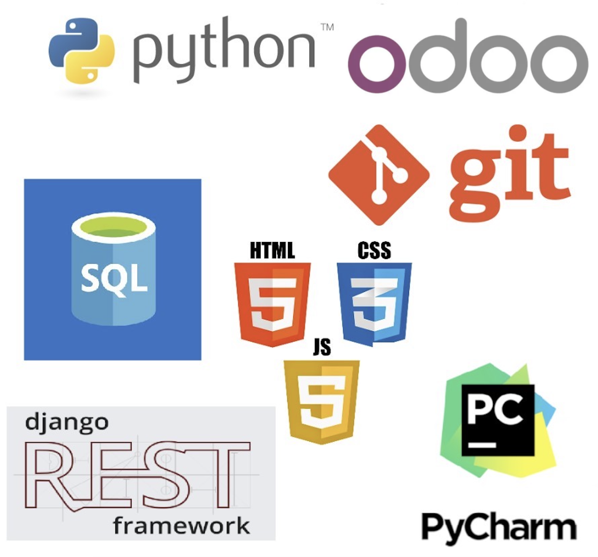

## Course Software Development Academy
I was pleased to participate in the "Python from Basics" course organized by the Software Development Academy. The course consists of over 300 hours of classes, and I devote many hours a week to independent work, thanks to which I gained knowledge on the following topics:
* Python: Python Basics, Python Technology, Python Intermediate, Algorithms and Data Structures,
* Testing and good practices: Software testing and TDD, Design patterns and good practices,
* Databases: SQL databases, Databases - programming.
* Frontend (HTML, CSS, JavaScript)
* Django

## Git and HTTP
During the course, I learned not only to program, but also developed my skills in many directions, including:
* I learned to work with the GIT tool (and Gitlab),
* I learned the basics of REST API and network tools, so that in my future work, I will be able to provide support during the back-end debugging process.

## Software Testing
I know that modern projects should not only be characterized by a well-designed, scalable and easily maintainable architecture, but also should be properly tested at the level of unit and integration tests. I learned to test my own code, which saved me a lot of time while developing my projects.

## My projects
[Used car dealer](carDealer.py) | 
[Bank account](bankAccount.py) | 
[Subscriptions](subscriptions.py) | 
[Bubble sort](bubbleSort.py) | 
[SQL school diary](SQL_dziennik_szkolny) | 
[Natural Life Organic Shop](https://github.com/grupaaaa/final-project) |

## Technologies

  
## Interested
I have a lot of ideas for spending my free time. These include travels, mountain tours and various types of physical activity.
 

 
## Contact
  
Contact by e-mail: alicjakochanowicz7@gmail.com
Linkedin: [Alicja Kochanowicz](http://www.linkedin.com/in/alicja-kochanowicz-057981202)
 
